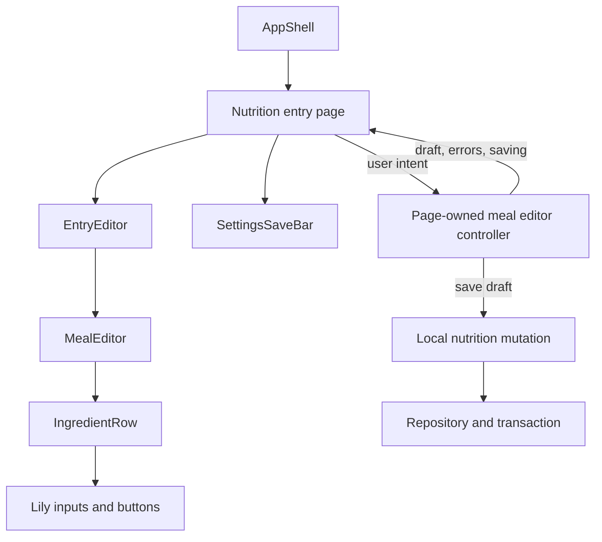

# Technical improvement list

Reviewed and implementation pass completed on 2026-09-05.

## Assessment and scope

The project has more structure than its prototype history suggests. It already has a tracker registry, Lily UI primitives, a local service boundary, separate native adapters, versioned backups, and useful tests. Those are foundations worth retaining.

At the start of the review, the main weakness was that the boundaries did not consistently control behavior. Relational storage is often accessed as large nested application snapshots; presentation reads can perform writes; refresh ownership is distributed across components; and forms and timed sessions each handle their own lifecycle. These patterns make a small change affect unrelated features and leave failure paths less reliable than the normal flow.

This review covers the SvelteKit shell and loaders, tracker screens, shared components, CSS and motion, SQLite/Dexie persistence, backup/restore, nutrition requests, native synchronization, relevant Android plugins, and validation tooling. The numbered findings preserve the original audit and explain why each change matters. Their descriptions and line numbers refer to the pre-implementation code; source links follow files that have since moved. Use the implementation status below to determine what remains applicable today.

Following the requested review, Sol and Terra subagents implemented the changes with integration and review in the main workspace. The current directory structure and dependency rules are documented in [docs/architecture.md](docs/architecture.md). The detailed architecture later in this report is the migration target: it includes further decomposition that has not all been performed. No Android device or emulator was available. Performance observations describe work performed by code, not measured device latency.

### Implementation status

“Implemented” describes the stated code change and its automated coverage. It does not imply that every broader device or scale acceptance criterion in the original audit has passed.

| Finding | Implemented in this pass | Remaining work or practical limit |
| --- | --- | --- |
| 1. Media preservation | Metadata-only edits preserve unresolved media references, invalid image input is rejected, and export fails safely on missing bytes. Native restore repairs missing or corrupt photos even when restored paths match existing metadata, with unique staged/backup paths, transaction-start cleanup and rollback. Failure-injection tests exercise real SQLite with mocked filesystem I/O. | Run the same interruption and recovery scenarios on Android storage. In-session rollback is tested; there is no durable operation journal or startup reconciliation for a process kill between filesystem promotion and SQL commit. Add that recovery mechanism before claiming crash-atomic media restore. |
| 2. Recoverable backups | TypeScript and Java enforce the same 25 MiB encoded JSON limit for export/import. Oversized exports fail before publishing a file. Version-two JSON and the five-file SAF retention policy remain intact. | Large photo histories above this limit remain unsupported. Streaming, reduced copying, and a lower-memory device benchmark are separate follow-up work; this change does not make multi-year photo backups unbounded. |
| 3. Consistent reads | Store reads/export join the mutation queue. Native connection instances sharing a handle use one operation queue and read transactions; Dexie uses encompassing read transactions. Dependent nutrition queries use one snapshot. Concurrency tests verify reads cannot mix parent and child revisions. | Browser multi-tab read-modify-write conflict handling still needs a database-wide mutation strategy. |
| 4. Calendar correctness | Shared local-day selection, impossible-date rejection, midnight/resume refresh, and date navigation preserving other URL state. | Verify real device time-zone changes and daylight-saving transitions. |
| 5. Startup recovery | Failed native connection promises reset, partial connection failures close resources, and root startup errors render a database-independent retry state. A standalone startup watchdog exposes reload if initialization stalls. | Native plugin behavior and a stalled startup must also be checked on a device. |
| 6. Bounded database access | Nutrition day, entry, fasting and progress queries use indexed predicates, load selected child rows in one snapshot, and avoid unrelated photos. Gamification reads exclude media. | Nutrition mutations still reconstruct their domain; targeted row mutations and bounded queries for every tracker remain to be implemented. |
| 7. Gamification ownership | Presentation reads are read-only, bootstrap reconciliation is limited to the local day, and shared views receive refreshed projections from one root event/refresh owner. Regression coverage checks that repeated bootstrap/gamification reads do no filesystem work. | Cross-tracker reconciliation still performs historical projection work. Incremental affected-date summaries need further implementation and measurement. |
| 8. Typed application operations | Nutrition create/update/delete, profile, fasting and query operations have inferred request/result contracts. Nutrition queries and mutations have domain modules; legacy nutrition endpoints delegate to the same implementations. | Other features retain the compatibility `apiRequest<T>` dispatcher. Continue migrating domain by domain; the service and state modules are still large. |
| 9. Persistence invariants | Backup validation rejects duplicate entity IDs/date records and unresolved or malformed images. Native migration coverage uses an immutable SQLite v2 fixture taken from repository history, rather than reconstructing the old schema from current definitions. | Broaden historical database/backup fixtures and schema maintenance coverage. Unsupported backup versions are still rejected explicitly. |
| 10. Loading and refresh | Local loaders register explicit resource dependencies. Refresh requests coalesce and drain a trailing refresh after in-flight work. Shared gamification views consume props. Date/entity URL changes control page identity and scroll reset. | `app:local` remains a conservative broad refresh dependency. Finer per-domain invalidation and reducing duplicated page-data aliases can be incremental improvements. |
| 11. Form state | Shared immutable submitted snapshots, dirty-state comparison and unsaved navigation guards are used by settings/profile/entry forms. Mid-save edits stay dirty, entity changes reset drafts, and successful mutations are distinguished from later navigation/refresh failures. | Mounted tests cover representative settings and nutrition paths, not every tracker form interaction. |
| 12. Initial loading | Optional native home-card work starts after local content renders instead of blocking initial local loading. | Measure cold startup on the target phone. |
| 13. Resource cleanup | Late listener and wake-lock acquisitions are disposed safely. Audio cancellation resolves waiting chains, routine transitions are owned, and obsolete announcements cannot advance destroyed sessions. | Native suspension/resume still needs device acceptance. |
| 14. Sync overlap | Concurrent requests merge tracker coverage and schedule a follow-up pass for requests arriving during an active sync, including the final promise-settlement boundary. | Confirm provider-specific throttling and permissions on Android. |
| 15. Timed sessions | Chores, meditation and guided routines pause on background and restore available session drafts as paused; recovery does not award completion. Breathing stops safely when hidden. Shared routine model/controller/timing/recovery code has an explicit owner. | Session storage is best-effort recovery, not a durable guarantee across Android process death. Decide whether fully durable interrupted-session records are a product requirement. |
| 16. Nutrition async work | AI and secret initialization have deadlines, abort/stale-result protection and retry/manual recovery. Draft identity and save submission are stable during asynchronous work. | Image compression remains a main-thread canvas operation; moving large image work off-thread and decomposing the capture page further remain useful. |
| 17. Manual nutrition | Manual creation and editing work without an API key or network access; AI is optional. A mounted browser test covers no-key creation and recovery after failed navigation without duplicate writes. | Exercise the complete camera/file/manual flow on Android. |
| 18. Restore coordination | An application maintenance gate drains whole native-sync, mutation and backup operations before restore. Restore resets reconciliation/session caches, reapplies reminders, refreshes loaded data and resets shell celebration state. Post-commit warnings do not invite unsafe restore retries. | Verify physical-device restore with active sessions, notifications and scheduled SAF work. |
| 19. Secret storage | Android uses secure storage. Migration and get/save/clear operations are serialized; a verified secure write precedes legacy plaintext removal. Tests cover failure and clear/migration races, existing secure values remove legacy plaintext, and failed legacy cleanup cannot remove the secure key then resurrect a stale copy. | Verify the installed secure-storage plugin on the target Android version. |
| 20. Theme contrast | Semantic status foreground/background pairs, readable muted text, an opaque darkened action surface and focus tokens replace several unsafe choices. Chromium tests calculate contrast for shared status/muted tokens in both modes and the brightest action endpoint. | This is not a full accessibility certification of every screen, image, disabled control or tracker palette. Device/TalkBack checks remain. |
| 21. Style ownership | Tokens, base rules and utilities have separate files. Feature styles live with their components. The document has one palette owner; dialog portals inherit it. Tailwind custom variants use the correct [`@custom-variant` declaration](https://tailwindcss.com/docs/functions-and-directives#custom-variant). | Continue moving any new feature-specific styles out of the global entry sheet. |
| 22. Component contracts | Button delegates activation to Pressable with discriminated link/button props. Save controls are pure presentation; pages explicitly register `PageActionBar`. Nested registrations restore their parent. Guided routines now have a small wrapper, execution controller and presentation view. | Keep tracker persistence/navigation in route adapters as these components evolve. |
| 23. Mobile interaction | Ingredient labels are associated with inputs; dialogs have viewport/safe-area bounds; Android Back closes the active overlay before navigating or exiting. Browser tests exercise keyboard controls, disabled activation and long-dialog bounds. | TalkBack, soft keyboard, gesture navigation and actual Android Back still require device testing. |
| 24. Boundary tests | Added mounted Chromium interaction/form/accessibility tests, native media/snapshot failure tests, paused-session tests, historical schema fixtures and an Android launch smoke test. CI runs browser tests in addition to the existing checks. | The Android smoke test was not executed locally because no Android SDK is configured. |
| 25. Recoverable errors | Bounded metadata-only diagnostics and explicit maintenance errors are available. Cadence saves offer retry. Nutrition creation/deletion and backup/restore distinguish persistence success from later navigation/status failures. | Error classification is not yet applied uniformly to every legacy catch block. |
| 26. Development discipline | The gradient experiment is development-only, Android template tests are replaced, README documents mobile commands and Node requirements, and Biome checks CSS/JSON plus unused TypeScript/JavaScript declarations. Formatting and mounted browser tests are executable CI checks. | Final checks ran on Node 25.9.0; CI uses Node 22. |
| 27. Folder/component architecture | Shared components are grouped under app, tracker, forms, metrics, routines and gamification. Home-only components stay in the root route. Tracker contracts, native database integration, incoming payload parsers and application candidate composition now have explicit owners. See the current [architecture guide](docs/architecture.md). | Further split the nutrition capture workflow, remaining service/state domain orchestration and root shell composition when implementing the next domain operations. The proposed tree later in this report includes these destinations. |

The [Android smoke-test checklist](docs/android-smoke-test.md) records the remaining platform acceptance work. The next code phase should first add durable media-operation recovery across process termination, then prioritize targeted mutations and multi-tab coordination, remaining domain/service extraction and large-history backup support. These are substantive remaining items, not changes claimed complete by the folder moves.

### Validation performed

| Check | Result |
| --- | --- |
| `npm run check` | Passed: 0 errors, 0 warnings. |
| `npm run lint` | Passed without warnings. |
| `npm run format:check` | Passed: 459 files checked. |
| `npm run test` | Passed: 58 files, 232 tests. |
| `npm run test:browser` | Passed: 4 files, 13 mounted Chromium tests. |
| `git diff --check` | Passed. |
| Original temporary review probes | Reproduced cached connection failure, photo corruption after a transient read failure, and export/import size mismatch. Permanent regression coverage now covers the fixes. |
| Production build | Not run, as required by `AGENTS.md`; no build-dependent Capacitor command was run. |
| Android/device validation | No device/emulator run. Local Gradle validation could not start without an Android SDK configuration (`ANDROID_HOME`/`sdk.dir`). The device checklist and launch test remain available for that environment. |

Local checks used Node 25.9.0. CI uses Node 22, so this is not an exact reproduction of the CI environment. The browser suite mounts real components with controlled service/native adapters; it is not a packaged-APK end-to-end test.

### Priorities

- **P1:** Correctness or data preservation; address before relying on the app for long-term records.
- **P2:** Reliability, performance, accessibility, or maintainability; address during the stabilization work.
- **P3:** Cleanup and development discipline; useful after the underlying contracts are settled.

## Original audit: data preservation and correctness

### 1. P1 — A temporary media read failure can permanently replace a photo with an empty file

**Evidence:** [database/connection.ts](src/lib/local/database/connection.ts), `loadNativeMedia` at line 511 and `stageNativeMedia` at line 528; [state.ts](src/lib/local/state.ts), `writeNutritionRows` at line 820 and media conversion at lines 1179–1192.

`loadNativeMedia()` catches filesystem read errors and leaves `blob` undefined. `mediaDataUrl()` represents that state as `stored-media:<id>`. If a subsequent nutrition mutation rewrites the domain, `writeNutritionRows()` treats that reference as image data. `parseDataUrl()` silently converts anything that does not match its data-URL pattern into an empty JPEG Blob. The generated path changes, the empty file is saved, and cleanup deletes the original file.

A temporary probe using the real store and Node SQLite, with a mocked filesystem, reproduced this: changing only an entry's notes after one injected read failure changed its photo from 5 bytes to 0 bytes and deleted the original path. The image bytes were a small synthetic fixture; the problem is the reference conversion, independent of JPEG decoding.

**Improve:** Represent media references and decoded image data as different types. Preserve a media ID through metadata-only edits. Reject malformed image input instead of manufacturing empty files. Distinguish “no photo” from “photo could not be read,” and prevent backup export from reporting success while substituting unresolved media references for photo contents.

**Acceptance:** Inject transient read failures during edits and exports. Existing photo bytes and references must remain intact, and the user must be able to retry.

### 2. P1 — The app can export backups that it refuses to restore

**Evidence:** [google-drive-backup.ts](src/native/google-drive-backup.ts), `MAX_IMPORT_BYTES` at line 15, export at line 77, and import checks at line 142; [backup.ts](src/lib/local/backup.ts), `createBackupEnvelope`; [nutrition.ts](src/lib/local/nutrition.ts), `MAX_NUTRITION_IMAGE_DATA_URL_LENGTH`.

Imports are limited to 25 MiB. Exports have no matching limit and include every meal photo as base64 in one JSON document. A temporary probe validated an export envelope containing 40 photos of approximately 700 KiB each, below the per-photo input limit, whose serialized size exceeded the import limit. The envelope is valid but cannot pass the current import size check.

Export also materializes multiple representations: file contents, Blobs, base64 strings, validated state, serialized JSON, and the Java bridge payload. The Android reader accumulates the whole file in memory too. Long-term meal history therefore creates both recoverability and memory-pressure problems.

**Improve:** Define one supported backup size policy across TypeScript and Java. Preserve versioned JSON and the five-file SAF retention rule. At minimum, check encoded export size before claiming success and support restoring every backup the app produces. Then reduce copying, consider explicit photo-size policies, and investigate incremental JSON/file processing for larger histories. Increasing the limit alone does not address memory use.

**Acceptance:** Export and restore a representative multi-year history with photos on a lower-memory Android device, including a fixture larger than 25 MiB.

### 3. P1 — Multi-table reads and backup exports do not have snapshot consistency

**Evidence:** [state.ts](src/lib/local/state.ts), `readDomains` at line 388, `exportState` at line 480, and `serialize` near line 588; [database/connection.ts](src/lib/local/database/connection.ts), both `read` implementations at lines 119 and 182.

Writes are serialized through `LocalAppStore.writeQueue`, but ordinary reads and exports do not join that queue. Native reads issue separate table queries without a read transaction. Browser reads use independent Dexie `toArray()` calls without an encompassing read transaction.

Consequently, a read can overlap a write or restore and combine tables from different moments. On the shared native connection it can also interleave with an open write transaction. An export might contain an entry's earlier totals and its later ingredient rows, or encounter a media path being retired by a concurrent write. The write transaction itself does not establish a coherent snapshot for these readers. This is a concurrency risk established by the call paths; an actual damaged user backup was not observed.

**Improve:** Give connection access an explicit transaction/snapshot contract. Serialize conflicting operations on the shared native connection and use consistent read transactions where appropriate. For export, capture metadata and retain its referenced media as one logical snapshot before releasing the operation. Browser multi-tab access needs database-level coordination; a per-instance JavaScript queue is insufficient there.

**Acceptance:** Run exports while saving nutrition, ingesting native data, and restoring state. Verify relationships, totals, and photo contents all correspond to a single committed revision.

### 4. P1 — Nutrition uses UTC “today” while the service uses the local calendar day

**Evidence:** [nutrition/track/+page.ts](src/routes/nutrition/track/+page.ts), line 7; [service.ts](src/lib/local/service.ts), `today`; [trackers/dates.ts](src/lib/trackers/dates.ts), `localDateForInstant`; [utils.ts](src/lib/utils.ts), `todayIso`.

The nutrition loader calculates today with `new Date().toISOString().slice(0, 10)`. The local service validates dates using the device's time zone. These disagree around midnight outside UTC. At 00:30 on September 5 in UTC+10, the loader considers September 4 to be today and can redirect a valid September 5 selection backward. At 20:30 on September 4 in UTC−7, the default loader date is September 5, which the service rejects as a future date.

There are also several calendar validators and day-shifting helpers. Some correctly use UTC only to perform calendar arithmetic; those should not be changed indiscriminately. However, [gamification/dates.ts](src/lib/gamification/dates.ts) accepts date-shaped but impossible values such as `2026-02-31`, which can reach `parseDate()` in the shared date selector.

**Improve:** Use a shared, time-zone-aware clock and calendar-date validator at route boundaries. Make “calendar date” and “instant” distinct concepts in types and naming. Add one app-level midnight/resume refresh policy so data called “today” does not remain stale while a tracker stays open overnight.

**Acceptance:** Check nutrition navigation in positive and negative UTC offsets, impossible dates, daylight-saving transitions, and a screen left open across midnight.

### 5. P1 — Storage startup recovery does not recover the failed connection

**Evidence:** [database/connection.ts](src/lib/local/database/connection.ts), `initialize`, `connection` at line 272, and `sharedNativeDatabaseConnection`; [routes/+layout.ts](src/routes/+layout.ts); [routes/+error.svelte](src/routes/+error.svelte); [app.html](src/app.html).

`NativeRelationalConnection.connection()` caches its promise using `??=`. The global connection factory clears its own rejected promise, and initialization clears its initialization promise, but the connection instance retains the rejection. A temporary probe confirmed that two reads after a transient open failure call the factory only once and receive the same failure. Retrying initialization on that instance therefore cannot reopen storage.

The recovery UI also sits on the wrong side of the dependency: root layout loading requires a successful bootstrap, but the custom `+error.svelte` is normally rendered inside that layout. A root-layout failure uses SvelteKit's fallback error page. The installed client code replaces the document with that fallback, so this is not a claim that every startup error stays hidden behind the spinner. A never-settling startup operation, however, has no app-controlled timeout or recovery path. [SvelteKit error behavior](https://svelte.dev/docs/kit/errors#Responses).

**Improve:** Clear the instance connection promise on rejection and handle partially opened native connections. Provide a minimal startup/recovery boundary that can render without the application database, with retry and safe diagnostics. Keep the loading-screen lifecycle independent of successful tracker loading.

**Acceptance:** Fail the first native open, allow the next one, and recover in the same application session. Exercise persistent failure and a stalled startup separately.

## Database access and application boundaries

### 6. P2 — Relational storage is still used like an in-memory document database

**Evidence:** [database/connection.ts](src/lib/local/database/connection.ts), `RelationalConnection`, `readTable`, and both `write` methods; [state.ts](src/lib/local/state.ts), `readProjection` and `readNutritionRows`; [service.ts](src/lib/local/service.ts), `nutritionLog` at line 466, `readNutritionEntry`, and `fastingStatus` at line 544.

The connection abstraction exposes table selection, but no date predicate, row lookup, ordering, limit, or aggregation. Native reads generate unrestricted `SELECT` statements; Dexie reads call `toArray()`. The service filters the resulting arrays afterward. Loading one meal, one nutrition day, or even a fasting boolean reads the nutrition domain with full media by default.

`readNutritionRows()` repeatedly filters all meals for each entry and all ingredients for each meal. Mutations reconstruct a domain, validate and clone it, convert it back into rows, reread existing rows, and calculate a diff. Writes do avoid rewriting equal rows, and some settings projections already select fewer tables; those optimizations are useful but do not bound the rows or media read.

**Improve:** Add task-specific repository methods under `src/lib/local/`, such as `getNutritionDay(date)`, `getNutritionEntry(id)`, `getFastingStatus(date)`, and bounded history queries. Use the existing indexes and return projections suited to the screen. Load photos only for visible entries, using references/URLs instead of base64 in general page data. Reserve full-state conversion for backup compatibility. Use targeted row changes for normal mutations.

**Acceptance:** Instrument table queries, rows returned, filesystem reads, and allocations. Reading a fasting flag must perform no image reads; editing one entry should have work proportional to that entry.

### 7. P2 — Gamification turns ordinary reads and unrelated saves into repeated global work

**Evidence:** [service.ts](src/lib/local/service.ts), `bootstrap` at line 137, `gamification` at line 150, and `updateWithCompletionNotification` at line 679; [state.ts](src/lib/local/state.ts), `GAMIFICATION_PROJECTION_TABLES` and `updateGamificationProjection`; [api.ts](src/lib/api.ts); [gamificationToast.svelte](src/lib/components/gamification/GamificationToast.svelte); [userCard.svelte](src/lib/components/app/UserCard.svelte).

Bootstrap and gamification GET requests acquire the write queue and reconcile awards and achievements. Many mutations load the gamification projection across all trackers, clone it for completion comparisons, and recalculate historical progress. Every non-GET `apiRequest` also dispatches a global event, even for settings or exercise-speed changes.

Both the achievement overlay and the mounted user card can respond with another gamification GET. A caller may then run `invalidateAll()`, causing bootstrap to reconcile again. This produces several independent refresh paths for the same derived data and puts history-dependent work on startup and small settings changes.

**Improve:** Separate reconciliation commands from read-only presentation queries. Perform the necessary award updates as part of a domain mutation or a deliberate reconciliation job, preserving existing award semantics. Publish one versioned result or change event from that operation. Let navigation, the user card, and celebration UI consume the same result. Incrementally update affected tracker/date summaries before considering broader caching.

**Acceptance:** Trace one happiness save and one exercise-speed change. Each should have a known, bounded reconciliation count and all visible gamification should agree.

### 8. P2 — The simulated HTTP interface obscures types and concentrates too many responsibilities

**Evidence:** [api.ts](src/lib/api.ts), `apiRequest<T>`; [service.ts](src/lib/local/service.ts), 1,445 lines; [state.ts](src/lib/local/state.ts), 1,247 lines; [api-types.ts](src/lib/api-types.ts); [actions/candidates.ts](src/lib/app/action-candidates.ts).

This is a local application, yet callers build `/api/app/...` strings, serialize request bodies, choose response types, and pass `RequestInit`. The service reparses those requests and casts its dispatch result to `Promise<T>`. The caller's type parameter is an assertion, not a contract connecting an operation to its actual request and response. Options such as an abort signal are not implemented as normal HTTP behavior.

`service.ts` combines dispatch, input validation, tracker queries, settings, rewards, nutrition mutations, date selection, and completion events. The eagerly imported service also reaches action candidates and tracker definitions, including the large fitness program. This makes dependency boundaries difficult to reason about even before measuring the production bundle.

**Improve:** Introduce typed local operations and small per-domain services/repositories under `src/lib/local/`. Keep a temporary endpoint adapter for existing callers while migrating. Keep tracker controllers and presentation helpers under `src/routes/<tracker>/`, as required by the project. Pure tracker definitions can be shared, but they should not import UI or persistence singletons. Make cross-domain orchestration explicit instead of making every service method handle it.

**Acceptance:** Calling a tracker operation with the wrong input or expecting the wrong response must fail type checking. A simple profile query should not require the full tracker mutation dispatcher.

### 9. P2 — Schema definitions, migrations, and backup invariants need a single maintenance strategy

**Evidence:** [database/schema.ts](src/lib/local/database/schema.ts), Drizzle tables, `TABLE_KEYS`, `TABLE_COLUMNS`, SQL DDL, and Dexie stores; [state.ts](src/lib/local/state.ts), `stateSchema` and row conversions; [backup.ts](src/lib/local/backup.ts), version rejection; [native-sqlite.integration.test.ts](src/lib/local/database/native-sqlite.integration.test.ts), `versionTwoSchema`.

Each persistence change can require coordinated edits to Drizzle definitions, manual column/key mappings, hand-written SQL, Dexie schema, state validation, and conversion functions. The current migration test derives the older schema by deleting statements from today's schema; it does not preserve an independent representation of what an older release actually shipped.

Backup validation checks many scalar types well, but it does not enforce all relational invariants: unique meal/ingredient IDs across entries, unique dated records, consistent stored nutrition totals, or valid embedded image contents. Duplicate IDs accepted in nested state can collide when flattened into primary-keyed tables. Version 1 backups are explicitly rejected, with no conversion path. Whether old prototype installations still require that path needs an inventory of released data formats.

**Improve:** Choose a canonical schema representation and generate or verify the repetitive mappings. Store immutable migration files and historical database/backup fixtures. Validate identity uniqueness, references, media, and derived totals before replacing data. Document supported versions and provide a migration/import path for every released format that must remain recoverable.

**Acceptance:** Run the same repository contract against Dexie and real SQLite, restore historical fixtures, and reject conflicting IDs without changing existing data.

## Loading, reactivity, and lifecycles

### 10. P2 — Refresh dependencies are implicit, and several pieces of UI maintain competing copies of data

**Evidence:** [routes/+layout.svelte](src/routes/+layout.svelte), native invalidation at line 130 and date metadata handling; [steps/settings/stepsSettings.svelte](src/routes/steps/settings/stepsSettings.svelte); [routes/+page.svelte](src/routes/+page.svelte), minute refresh; [fitness/+page.svelte](src/routes/fitness/+page.svelte); [dateSelectorState.svelte.ts](src/lib/components/tracker/date-selection-context.svelte.ts).

Loaders use the custom local API without registering `depends()` identifiers. Most saves consequently use `invalidateAll()`. Other screens update local completion sets or cached results instead. The shell reads date/navigation data from `page.data`, while the home page's minute timer updates a private `actionFeed` copy. Those two views of the day can diverge, particularly at midnight. Gamification has additional event-driven copies.

The shell's `DatedPageData` union-like shape recognizes `markedDates`, `completedDays`, `meditationHistory`, and `trackedDates` manually. Every new tracker representation can require another shell exception. `dateHref()` also reconstructs URLs from a pathname and date, discarding unrelated query parameters.

**Improve:** Define resource dependencies such as `app:profile`, `app:gamification`, and tracker/date keys, then invalidate affected resources. A custom client that bypasses SvelteKit fetch needs explicit dependencies. Give dated pages a standard navigation projection and one owner for refreshed data. Preserve independent query parameters. [SvelteKit loading and invalidation](https://svelte.dev/docs/kit/load#Rerunning-load-functions).

**Acceptance:** Saving steps settings should not reload unrelated nutrition data. The home feed, date selector, and day summary should agree after minute, midnight, and resume refreshes.

### 11. P2 — Form drafts do not have a consistent identity, save, or navigation contract

**Evidence:** [nutrition/entry/[entryId]/+page.svelte](src/routes/nutrition/entry/[entryId]/+page.svelte), `const initial` at line 32 and save at line 63; [stepsSettings.svelte](src/routes/steps/settings/stepsSettings.svelte); [nutritionSettings.svelte](src/routes/nutrition/settings/nutritionSettings.svelte); [periodEntry.svelte](src/routes/period/components/periodEntry.svelte); [happinessEntry.svelte](src/routes/happiness/components/happinessEntry.svelte); [settingsSaveBar.svelte](src/lib/components/forms/SettingsSaveBar.svelte).

The nutrition editor captures the initial entry once, including the ID used for PUT/DELETE. The shell is keyed by route ID, which does not change between two `/nutrition/entry/[entryId]` URLs. Same-route parameter navigation can therefore retain the earlier draft and target ID. Other forms initialize with `untrack()` and never reconcile later values, while period/happiness implement their own date/update/default comparison logic. SvelteKit load reruns preserve component state, so this behavior needs an explicit policy. [SvelteKit component reuse](https://svelte.dev/docs/kit/load#Rerunning-load-functions).

Save behavior also varies. The nutrition editor has no in-flight save/delete guard. Many settings pages omit `dirty`, leaving `SettingsSaveBar` permanently in its default “changed” state. Inputs often remain editable while a save is pending, and some handlers mark the current draft as saved after awaiting an earlier submitted payload. Date navigation and route changes have no common protection for unsaved work.

**Improve:** Establish a small shared mutation/draft helper with an entity key, saved baseline, submitted snapshot, pending state, structured error, and reset rules. Reset on entity changes; reconcile refreshed data only according to a deliberate dirty-state policy. Mark the submitted snapshot as saved, and preserve later edits. Use one navigation policy for unsaved drafts and active sessions.

**Acceptance:** Test same-route entry changes, editing during a delayed save, rapid duplicate submit, date changes with unsaved notes, and failed refresh after a successful write.

### 12. P2 — Optional native work blocks the initial local screen

**Evidence:** [routes/+page.ts](src/routes/+page.ts); [native/action-feed.ts](src/native/action-feed.ts), `loadNativeActionFeedItems`; [android-updater.ts](src/native/android-updater.ts); [AndroidUpdaterPlugin.java](android/app/src/main/java/com/zuncreative/selfimprovement/AndroidUpdaterPlugin.java), network timeouts; [routes/+layout.ts](src/routes/+layout.ts).

The home loader waits for native action items before returning. Those items wait together for permissions, sync status, and a GitHub release check. A slow update check therefore delays a locally available action feed. The Java updater has connect/read timeouts, but the check remains on the critical rendering path. `Promise.all` also makes an access/status failure discard otherwise available native items when the page catches the result as `[]`.

The root bootstrap already performs broad gamification work. Combined with native checks, a startup spinner can hide the distinction between local database initialization and optional network/native maintenance. Subsequent navigation has no shared pending presentation tied to the router.

**Improve:** Render essential local state first. Refresh update availability and independent native status sections afterward, each with its own pending/error result. Cache the last usable result and use request identity guards. Add a restrained navigation/loading treatment driven by the actual operation rather than ad hoc component booleans.

**Acceptance:** Cold launch and open the home page with a slow or unavailable GitHub connection. Local tracking must remain usable while update availability resolves separately.

### 13. P2 — Asynchronous resource acquisition can outlive its component

**Evidence:** [routes/+layout.svelte](src/routes/+layout.svelte), line 104; [permissionsHub.svelte](src/routes/profile/components/permissionsHub.svelte), line 109; [native/app.ts](src/native/app.ts), `listenForResume`; [guidedRoutineRunner.svelte](src/lib/components/routines/GuidedRoutineRunner.svelte), mount/destroy and `requestWakeLock`.

Resume listeners are registered asynchronously into a mutable cleanup function initialized as a no-op. If the component is destroyed before registration resolves, cleanup runs too early and the eventual native listener remains registered. Registration failures are not handled at those call sites. The helper also discards listener promises without a general rejection policy.

The routine runner has a similar acquisition race: a wake-lock request can resolve after destruction, after the only release attempt has already run. Its zero-duration transition uses `setTimeout(advance, 0)` without retaining the handle. These are source-level lifecycle defects; their frequency on Android has not been measured. The camera startup helper already uses attempt IDs and stale-stream disposal, which is a useful pattern to extend.

**Improve:** Standardize disposal-aware resource acquisition. If a resource arrives after disposal, release it immediately; otherwise register its teardown. Handle registration failures explicitly. Retain and cancel every timer. Apply the same ownership rule to listeners, wake locks, camera streams, and asynchronous UI refreshes.

**Acceptance:** Delay listener/wake-lock acquisition, navigate away, then resolve it. No listener, lock, timer, or late UI update should survive the owner.

### 14. P2 — Overlapping synchronization silently drops newly requested trackers

**Evidence:** [sync-coordinator.ts](src/domain/sync-coordinator.ts), `startSync` at line 59; [sync-coordinator.test.ts](src/domain/sync-coordinator.test.ts), “coalesces overlapping sync requests”; [permissionsHub.svelte](src/routes/profile/components/permissionsHub.svelte), permission and manual-sync actions.

`startSync()` returns the current promise whenever a sync is active, without comparing the requested tracker sets. If steps are syncing and another caller requests sleep, the second caller gets the steps report and sleep is never collected. The existing test explicitly asserts this behavior. Sharing the same work is useful for duplicate requests, but different requested work is being discarded.

This matters when root resume maintenance, the permissions screen, and a manual retry overlap. A permission action can await synchronization and appear finished even though its tracker was not part of the active operation. A request made after permission changes can also inherit an earlier result.

**Improve:** Track pending tracker IDs and run a follow-up batch, or deduplicate per tracker. Define whether explicit requests require a fresh attempt after a permission change. Resolve each caller only when its requested work has been attempted, returning the relevant report.

**Acceptance:** Start steps sync, request sleep before it completes, then verify that both requested trackers execute and each caller receives an appropriate result. Replace the test that currently treats dropped work as correct.

### 15. P2 — Timed sessions lack a consistent background, interruption, and recovery policy

**Evidence:** [meditationTimer.svelte](src/routes/meditation/components/meditationTimer.svelte); [choresTimer.svelte](src/routes/chores/components/choresTimer.svelte); [breathingExercise.svelte](src/routes/breathing/components/breathingExercise.svelte); [guidedRoutineRunner.svelte](src/lib/components/routines/GuidedRoutineRunner.svelte); [audio-manager.ts](src/lib/audio/audio-manager.ts).

Meditation and chores use wall-clock deadlines; breathing derives elapsed time from `Date.now()`; fitness/stretch consume `performance.now()` deltas. Using deadlines avoids simple interval drift, but background behavior remains implicit. The routine's visibility handler only reacquires a wake lock. After a long suspension it can consume the elapsed time for the current activity and advance one phase, while other timers can immediately complete on resumption. There is no shared decision about whether hidden time should count.

Active sessions and pending completions live in component memory. Route changes or Android process recreation lose that state. Audio has further sequencing concerns: `stopAll()` resolves waiting one-shot promises, so an `announceActivity()` chain can continue to its next sound after a skip or close. `destroy()` has no disposed guard preventing later `play()` calls.

**Improve:** Extract reusable timing/session logic from rendering while keeping tracker-specific controllers under their routes. Define per-session background behavior, freeze session configuration at start, and persist enough state to recover or explicitly abandon a session. Add cancellation tokens for audio sequences and reject/ignore operations on a destroyed manager. Keep completion commands idempotent and retain failed completions until resolved.

**Acceptance:** Check lock/unlock, app switching, navigation, clock changes, midnight, process recreation, rapid skip/close, and failed completion persistence. Treat physical-device audio and timing verification as required here.

### 16. P2 — Nutrition's asynchronous workflow has no request cancellation or stale-result contract

**Evidence:** [nutrition/track/+page.svelte](src/routes/nutrition/track/+page.svelte), 817 lines, `initialize`, `analyzeMeal`, `submitCorrection`, and `confirmMeal`; [meal-analysis.ts](src/routes/nutrition/ai/meal-analysis.ts), request at line 164; [camera.ts](src/routes/nutrition/track/camera.ts).

The page owns secret loading, camera acquisition, image compression, analysis, refinement, editing state, persistence, and navigation. The camera has an attempt guard, but analysis/refinement requests have no abort signal, timeout, or request identity. Navigating away can leave remote work running. A save continuation can also navigate back into nutrition after the user has already left. A rejected secret read in `initialize()` is launched with `void` and has no local catch, leaving the checking phase without an actionable error.

Image compression repeatedly creates canvases and calls synchronous `toDataURL()` across sizes and qualities. This is bounded, but it is main-thread work that should be measured on actual phones.

**Improve:** Move the workflow state machine into a route-owned controller and split camera, source input, estimate review, and correction UI into focused components. Accept cancellation and request IDs in the AI client; suppress stale results and post-navigation redirects. Model setup/read failures explicitly. Use asynchronous image encoding where practical and measure compression time before choosing a worker-based implementation.

**Acceptance:** Leave during secret loading, analysis, refinement, and save. No obsolete request may replace a newer estimate or pull the user back to a route. Simulate a request that never completes.

### 17. P2 — Optional AI is effectively required to create a nutrition entry through the UI

**Evidence:** [README.md](README.md), optional OpenRouter/manual nutrition description; [nutrition/track/+page.svelte](src/routes/nutrition/track/+page.svelte), `initialize` and the setup phase; [entryEditor.svelte](src/routes/nutrition/components/entryEditor.svelte); [service.ts](src/lib/local/service.ts), `createNutritionEntry`.

The service supports locally entered ingredients and the app has an editable meal component, but the creation route switches to an OpenRouter setup screen whenever no key is available. Description entry also uses AI. The existing `EntryEditor` is only used to edit an existing entry. Thus an optional remote integration is coupled to the availability of the core local creation flow.

**Improve:** Make manual entry a first-class route state using the existing Lily editor. Treat AI as a way to populate the same editable draft. Key configuration, network availability, and provider failures should affect analysis availability rather than local record creation. Share validation and persistence between manual and AI-assisted entry.

**Acceptance:** With no key and no network, create a meal, edit ingredients, save it, reopen it, and include it in a backup round trip.

### 18. P2 — Restore replaces persisted state without coordinating the running application

**Evidence:** [dataBackupCard.svelte](src/routes/profile/components/dataBackupCard.svelte), `confirmRestore`; [google-drive-backup.ts](src/native/google-drive-backup.ts), `restoreBackup` and scheduled backup ownership; [state.ts](src/lib/local/state.ts), `replaceState`; [sleep/reminders.ts](src/routes/sleep/reminders.ts); [gamificationToast.svelte](src/lib/components/gamification/GamificationToast.svelte).

The restore UI has a confirmation and the store performs transactional row changes, which should remain. Afterward, the UI only calls `invalidateAll()`. It does not explicitly coordinate active native collection, automatic export, reminder scheduling, or component caches. Work already in flight can finish against the newly restored state. A restored bedtime/reminder setting does not immediately reschedule the existing Android notification through this path.

Some in-memory state is intentionally monotonic: the achievement toast merges previously unlocked achievements into later snapshots. That is useful against stale reads during normal use, but restoration of an older backup needs a distinct reset boundary. Other device state, such as theme, volume, setup completion, backup destination, and the API key, lives outside the exported tracker state; that scope should be explicit.

**Improve:** Introduce an app-level restore operation that coordinates persistence and maintenance. Finish or invalidate conflicting work, replace the validated state, reset relevant caches/baselines, apply restored reminder settings, and publish a new state generation. Deliberately retain device-specific permissions, secrets, and SAF configuration where appropriate and document those exclusions.

**Acceptance:** Restore while a native sync or automatic backup is pending. Verify the chosen state wins consistently and notifications and displayed settings match it immediately.

### 19. P2 — The OpenRouter key uses the browser database even on Android

**Evidence:** [secrets.ts](src/lib/local/secrets.ts); [secure-repository.ts](src/native/secure-repository.ts); [package.json](package.json).

`LocalSecretStore` always stores the key as a plain string in Dexie. Separating it from app backups is good, but naming a database “secrets” does not add protection at rest. The project already includes a native secure-storage dependency, currently used elsewhere for setup/obsolete-key handling, so the Android credential does not use the platform-specific storage boundary already available to the app.

**Improve:** Keep the public secret-store interface under `src/lib/local/` and provide an Android adapter under `src/native/` backed by the existing secure-storage integration. Retain an explicit browser-development fallback. Migrate an existing key by writing and verifying the new location before deleting the old value. This improves storage at rest; it does not make a key inaccessible to an already compromised running application.

**Acceptance:** Verify migration, failed secure writes, key removal, and continued exclusion from both manual and automatic backups. Avoid logging credential values during failures.

## Theming, components, and mobile interaction

### 20. P2 — Color choices need contrast guarantees, not just light/dark variants

**Evidence:** [global.css](src/routes/global.css), palettes and highlighted/active profiles at lines 540–557; [toaster.svelte](src/lib/components/ui/toast/toaster.svelte), `toastColor` at line 118 and text at line 148; [trackerSection.svelte](src/lib/components/tracker/TrackerSection.svelte); [dateSelector.svelte](src/lib/components/tracker/DateSelector.svelte).

Buttons and date selection use white text over tracker gradients, including bright yellow and cyan. Highlighted/active backgrounds are often only 60% opaque, making contrast dependent on the surface beneath them. Dark mode changes neutrals and some status text colors but keeps the same tracker palettes and the same white-on-color assumption.

There are definite contrast failures in simple solid-color cases. Calculating relative luminance from the configured CSS colors gives these ratios for white toast text:

| Toast background | Contrast with white |
| --- | --- |
| Success `#10b981` | 2.54:1 |
| Error `#ef4444` | 3.76:1 |
| Info `#3b82f6` | 3.68:1 |

The toast uses small text, for which WCAG AA requires 4.5:1. Likewise, `--text` at 48% opacity over the light `--bg` calculates to approximately 3.37:1. These are token calculations, not a full rendered contrast audit. Gradients need sampling where text actually sits. [WCAG contrast guidance](https://www.w3.org/WAI/WCAG22/Understanding/contrast-minimum.html).

**Improve:** Separate decorative gradient colors from accessible text/control colors. Define foreground/background pairs for actions, statuses, and muted text in both modes. Use opaque or deliberately darkened surfaces behind small labels where needed. Validate focus indicators and selected states too.

**Acceptance:** Check every tracker palette across light/dark mode, buttons, date selection, toasts, and dialogs, including translucent and gradient backgrounds.

### 21. P2 — Global styling mixes design tokens, feature styling, and component implementation details

**Evidence:** [global.css](src/routes/global.css), 625 lines; [routes/+layout.svelte](src/routes/+layout.svelte), document-root theme effect and repeated shell CSS variables; [trackers/registry.ts](src/lib/trackers/registry.ts).

Centralized CSS variables are a good foundation. However, the global stylesheet also contains the gradient lab, happiness-slider internals, action-card pseudo-elements, toast positioning, and button profiles selected by broad `data-*` attributes. Feature-specific details require editing the app-wide stylesheet, and global heading selectors recolor all `h1`/`h2`/`h3` under an active tracker, including portaled surfaces through the document-root theme.

The active palette is written both to `document.documentElement` and to the shell. This makes ownership unclear, particularly for overlays that escape the shell. Typography and secondary text still use many arbitrary tracking values, sizes, and opacity percentages at call sites, so a global accessibility or density adjustment requires editing many components.

**Improve:** Keep foundational color, typography, spacing, safe-area, and motion tokens global. Move tracker-specific styles into their tracker components and primitive internals into Lily components. Establish one documented theme owner and a deliberate strategy for portals. Scope component variants to their component slot rather than any matching data attribute. Define a small semantic typography/muted-text scale and migrate repeated literals as components are touched.

**Acceptance:** A new tracker should need a palette/registry entry and route code, without selector exceptions in global CSS. A dialog's appearance should follow an explicit theme contract.

### 22. P2 — Shared components exist, but their contracts duplicate behavior and hide shell coupling

**Evidence:** [ui/button/button.svelte](src/lib/components/ui/button/button.svelte) and [ui/pressable/pressable.svelte](src/lib/components/ui/pressable/pressable.svelte); [ui/bottom-action-bar/bottom-action-bar.svelte](src/lib/components/ui/bottom-action-bar/bottom-action-bar.svelte); [bottomActionBarState.svelte.ts](src/lib/components/app/action-bar-context.svelte.ts); [guidedRoutineRunner.svelte](src/lib/components/routines/GuidedRoutineRunner.svelte).

Button and Pressable duplicate route resolution, anchor/button branching, motion setup, and teardown. Both combine all anchor and button attributes into one intersection type. For a disabled anchor they remove `href` and set `aria-disabled`, but forwarded click handlers remain, and `disabled:*` styling does not give anchors native disabled behavior. A disabled link with a callback can still execute it unless the callback separately guards itself.

The bottom action bar lives under `ui` but requires an app-shell context and renders its snippet elsewhere. The context holds one bar, so simultaneous consumers use implicit “last registration wins” behavior rather than a defined stack or ownership rule. The 564-line routine runner is shared usefully by fitness/stretch, but combines timing, audio, wake locks, transitions, and rendering.

**Improve:** Retain Lily and extract one tested interaction core for Button/Pressable, with discriminated link/button props and explicit disabled activation behavior. Keep shell registration in an app-specific wrapper around a presentation-only action bar. Document ownership when nesting workflows. Separate routine execution from the visual runner without creating a universal tracker component with many feature switches.

**Acceptance:** Test disabled mouse/keyboard activation, link attributes, teardown, rendering outside the shell, and competing action-bar consumers.

### 23. P2 — Accessibility and Android navigation need checks beyond compiler warnings

**Evidence:** [nutritionSettings.svelte](src/routes/nutrition/settings/nutritionSettings.svelte), select labels; [periodEntry.svelte](src/routes/period/components/periodEntry.svelte), flow label; [field-label.svelte](src/lib/components/ui/field/field-label.svelte); [select-trigger.svelte](src/lib/components/ui/select/select-trigger.svelte); [dialog-content.svelte](src/lib/components/ui/dialog/dialog-content.svelte); [native/app.ts](src/native/app.ts); [routes/+layout.svelte](src/routes/+layout.svelte).

Several `FieldLabel` instances are plain labels without a `for` relationship to their select trigger. `FieldLabel` does not supply context automatically, so visible text such as “Gender,” “Activity level,” or “Flow” is not programmatically associated with the control. A trigger announcing only its selected value loses important context.

The shared dialog is vertically centered but has no default safe-area-aware maximum height or scroll containment. Long content, a keyboard, landscape orientation, or enlarged text can make actions difficult to reach. The app shell has a nested scroll container, while date changes preserve the route ID; scroll restoration/reset behavior therefore deserves explicit testing.

There is no app-level Android back-button handler in `src/native/app.ts`. Default history behavior may leave a workflow instead of dismissing its currently open overlay or preserving a draft. This is a device-testing gap, not a claim that every back press is broken. Capacitor exposes a back-button hook, and registering it replaces default behavior, so any handler must implement the complete navigation policy. [Capacitor App API](https://capacitorjs.com/docs/apis/app#addlistenerbackbutton-).

**Improve:** Add stable label IDs and control relationships, bounded scrollable dialogs, and a tested back/overlay/draft policy. Verify focus restoration, TalkBack names, large text, keyboard visibility, and scroll behavior in the real WebView.

**Acceptance:** Complete nutrition settings and backup confirmation using TalkBack; dismiss an overlay with Android back; enter long notes with a keyboard at enlarged text settings.

## Validation and ongoing maintenance

### 24. P2 — Tests cover business logic well but miss the boundaries where the main defects occur

**Evidence:** [vite.config.ts](vite.config.ts), Node-only test environment; [native-sqlite.integration.test.ts](src/lib/local/database/native-sqlite.integration.test.ts); [connection.test.ts](src/lib/local/database/connection.test.ts); [android.yml](.github/workflows/android.yml); Android test directories.

The 183 passing tests are useful, especially date ranges, payload validation, local mutations, and sync status. However, tests importing helpers from `.svelte` files do not mount and interact with the components. The SQLite integration uses `node:sqlite` and a hand-built adapter; it does not exercise Capacitor's Android connection lifecycle, filesystem, or SAF provider. Android instrumentation currently contains the starter example, and CI runs `test`/`lint`, not an app-specific connected-device suite.

This explains why passing checks coexist with missing cleanup, contrast failures, stale form identity, and media recovery defects. Native permission and notification behavior also depends on conditions the Node test environment cannot reproduce.

**Improve:** Add a small, risk-focused set of mounted-component/browser tests and Android integration scenarios. Start with the acceptance cases in items 1–5, then cover delayed saves, resource teardown, backup/restore, and navigation. Keep historical migration fixtures and run repository contracts against both backends. Add a representative large-history performance fixture and measure bounded query/media counts instead of asserting only final values.

**Acceptance:** CI should reproduce the highest-priority failure paths, while a documented device smoke test covers permissions, resume, notifications, audio, camera, and SAF backup round trips.

### 25. P2 — Error handling often removes the information needed to diagnose or recover

**Evidence:** [api.ts](src/lib/api.ts), `recordAchievementEvents`; [routes/+layout.svelte](src/routes/+layout.svelte), reminder catch; [workoutSession.svelte](src/routes/fitness/components/workoutSession.svelte), `saveCadence`; [google-drive-backup.ts](src/native/google-drive-backup.ts), error mapping; [capacitor.config.ts](capacitor.config.ts), disabled native logging.

Several catches silently return; others only log to the console; some convert a whole set of failures into an empty result or a generic message. For example, an exercise-speed change updates visible state, but persistence failure only reaches `console.error`. A successfully committed form mutation followed by failed invalidation may also be reported as a save failure because both are inside the same catch.

There is already useful error infrastructure for native sync categories and sanitized initialization detail. It should become a consistent application convention rather than remaining specific to those features.

**Improve:** Define errors with an operation, category, retryability, and whether data was committed. Use local, bounded diagnostic records that exclude keys and sensitive tracker content. Show actionable feedback for failed user-initiated operations; keep best-effort background failures available in the relevant status screen. Separate persistence success from presentation-refresh failure and avoid automatic retries that could duplicate non-idempotent mutations. No remote analytics service is required.

**Acceptance:** A failed cadence write must be visible and retryable; a successful meal save followed by a refresh error must not invite an unsafe duplicate create.

### 26. P3 — Remove prototype residue and make development conventions executable

**Evidence:** [gradient-test/+page.svelte](src/routes/gradient-test/+page.svelte); [biome.json](biome.json); [package.json](package.json); [README.md](README.md); [periodEntry.svelte](src/routes/period/components/periodEntry.svelte); Android starter test packages under `com/getcapacitor/myapp`.

The gradient playground is an ordinary production route. Its styles are also global. Android starter tests remain under the template application package. The period form says notes are private to an “account,” although this app has no account system. Documentation describes manual nutrition entry that the creation UI does not currently expose.

Biome disables unused-import and unused-variable rules globally and does not include CSS/Markdown/JSON in its configured file set. The lint script does not check formatting, so style consistency is not enforced by the current required checks. Node 22 is documented and used in CI, but `package.json` has no engine declaration. README's sequence of `mobile:build`, `mobile:sync`, and `mobile:android` invokes the build repeatedly because the aliases already chain it.

**Improve:** Put development-only playgrounds behind a development gate or separate non-shipped fixture. Remove irrelevant starter tests and stale product copy. Gradually enable useful unused-code checks with narrow exceptions, add an explicit formatting check with intentional file coverage, and declare the supported Node version. Document one canonical mobile build/sync/run sequence while retaining useful mobile and Capacitor aliases. Update architecture notes as the persistence boundaries change.

**Acceptance:** The shipped route set and Android tests represent actual features; documentation matches the app; a clean checkout has one reproducible validation and mobile packaging workflow.

### 27. P2 — Folder and component ownership should be predictable from the feature being changed

**Evidence:** [src/lib/components](src/lib/components) mixes app navigation, tracker layouts, metrics, forms, celebrations, and routine execution in one directory. [src/lib/local](src/lib/local) mixes connection/state infrastructure, tracker-specific operations, catalogs, and presentation icons. The home feed's components sit directly beside root route files, and individual trackers use different arrangements for their settings and helper modules.

The current structure often tells a developer the technical file type without identifying its owner. A nutrition change can require understanding a large shared service, a large shared state converter, route-local business types, and an 817-line page. A generic-looking component may also depend on the app shell or perform data access. Simply creating more folders would preserve these ambiguities unless the component and import contracts change with them.

**Improve:** Adopt the concrete structure and ownership rules below. Group shared components by their purpose, keep tracker UI and workflow state within the tracker route, organize local operations by the same tracker/domain names, and keep native implementation in `src/native/`. Separate rendering, workflow state, durable data, and device resources. Give each stateful component a clear owner and expose narrow data/callback contracts to its children.

**Acceptance:** A developer can locate a tracker form, its controller, its persistence operation, and its native adapter from their names. A new tracker follows one example without modifying a generic tracker renderer or adding cases throughout the app shell. Shared presentation components can be exercised without opening the database or registering native listeners.

## Original suggested implementation order

| Stage | Work | Exit condition |
| --- | --- | --- |
| 1. Protect existing records | Items 1–5; backup identity/media validation from item 9 | Photo failures cannot destroy originals; every supported export restores; snapshots are coherent; local dates agree; startup retries work. |
| 2. Bound data access | Items 6–9, 10, 14, and the ownership rules in item 27 | Typed local queries and mutations; bounded row/media reads; one controlled reconciliation path; no dropped sync requests. |
| 3. Define app lifecycle | Items 11–19 and 25 | Stable draft identity, cancellable work, recoverable sessions, coordinated restore, usable offline nutrition, and actionable failures. |
| 4. Consolidate presentation | Items 20–23 and component organization in item 27 | Accessible token pairs, scoped styles, reliable primitive contracts, predictable component ownership, and verified Android interaction. |
| 5. Prevent regression | Item 24 throughout; item 26 as touched areas stabilize | Tests cover the failure paths and device boundaries; tooling and documentation enforce the resulting conventions. |

The stages should overlap where a regression test is needed before a fix. Avoid a single rewrite that changes schema, service contracts, UI, and lifecycle behavior simultaneously. Start with one vertical slice—nutrition is the strongest candidate because it exposes the media, query, backup, form, and optional-network boundaries—and preserve compatibility while moving callers to the new contracts.

## Concrete folder structure and component architecture

This section describes the target architecture and the rationale for it. The implementation status above and [current architecture guide](docs/architecture.md) distinguish completed moves from remaining extractions. References to “current” below describe the original audit baseline.

The organizing principle should be **feature ownership, with shared infrastructure grouped by responsibility**. To change nutrition, start in `src/routes/nutrition/` for the user experience and `src/lib/local/nutrition/` for durable data. To change how every tracker presents a section, start in `src/lib/components/tracker/`. To change Android behavior, start in `src/native/`.

The following paths are proposed destinations, not directories already created by this review. Keep the URLs and `src/routes/<tracker>/` ownership required by `AGENTS.md`. SvelteKit supports colocating route-specific components with their routes. [SvelteKit project structure](https://svelte.dev/docs/kit/project-structure#Project-files-src).

### A. Give the top-level directories distinct jobs

```text
src/
  routes/
    +layout.ts                    Essential bootstrap data and route requirements
    +layout.svelte                Compose AppShell and application providers
    +error.svelte
    +page.ts                      Home feed data
    +page.svelte                   Home screen composition
    components/                   Components used only by the home screen
      ActionFeed.svelte
      ActionFeedItem.svelte
    action-feed.ts                Home-specific feed presentation helpers
    steps/                        Tracker UI, settings, and client workflow
    sleep/
    screen-time/
    fitness/
    nutrition/
    meditation/
    breathing/
    stretch/
    chores/
    happiness/
    period/
    profile/                      Profile screens and profile-only components
    shop/
    achievements/
    streaks/
    android-setup/
    android-data-help/

  lib/
    app/
      application.ts              Assemble services and inject dependencies
      model.ts                    Composed application projections
      action-candidates.ts        Register pure tracker candidate definitions
      action-feed.ts              Combine local projections and selected candidates
      resources.ts                Resource keys and application refresh contract
      restore.ts                  Coordinate restore, caches, and device maintenance
    components/
      ui/                         Existing Lily primitives; preserve their system
      app/                        AppShell, navigation, drawer, action-bar outlet
      tracker/                    TrackerPage, TrackerSection, history, date selection
      metrics/                    MetricStat, CircularProgress, MetricProgressRow
      forms/                      Shared form presentation such as SettingsSaveBar
      routines/                   Shared guided routine presentation
      gamification/               Achievement celebrations and progress icons
    forms/                        Shared draft/mutation mechanics, only where reused
    routines/                     Shared timing engine and routine model
    audio/                        Audio resource management and volume state
    motion/                       Shared animation behavior
    styles/                       Tokens, base styles, shared utilities
    trackers/
      registry.ts                 Tracker metadata and capabilities
      dates.ts                    Shared calendar-date operations
      progress.ts                 Shared tracker progress presentation contracts
    actions/                      Cross-tracker action selection
    gamification/                 Shared gamification presentation helpers
    local/
      database/                   Relational/Dexie adapters, schemas, transactions
      steps/                      Local steps queries and mutations
      sleep/
      screen-time/
      fitness/
      nutrition/
      meditation/
      breathing/
      stretch/
      chores/
      happiness/
      period/
      profile/
      rewards/
      gamification/               Award rules, reconciliation, persisted projections
      backup/                     JSON versions, validation, export/import mapping
      native/                     Native payload ingestion into local records
      secrets.ts                  Platform-independent credential interface

  native/
    app.ts                        Start, stop, resume, and back-button ownership
    platform.ts
    database.ts                   Capacitor SQLite acquisition and cleanup
    sync/                         Native jobs and sync scheduling/coalescing
    health.ts
    usage.ts
    sleep-reminders.ts            Android notification implementation
    google-drive-backup.ts        SAF bridge and provider integration
    android-updater.ts
    secure-storage.ts             Platform-specific credential implementation

  domain/                         Native transport contracts and provider-to-payload conversion
  app.html
  error.html                      Minimal database-independent fallback

static/                           Media requiring stable public paths
android/app/src/main/java/com/zuncreative/selfimprovement/
                                  Native Java plugins
```

This is a map of responsibilities, not a folder-generation checklist. A small tracker may need one local operation module until its query/mutation responsibilities grow. Create shared `forms/` or `routines/` helpers only when extracting actual repeated behavior. Keep a single application and the existing mobile packaging workflow.

`src/lib/app/` is the composition point: it connects local operations to platform adapters and defines cross-feature application operations. It should remain small. Android lifecycle implementation belongs in `src/native/`; backup replacement and schemas belong in `src/lib/local/`. The composition point coordinates them without becoming another `service.ts` containing every tracker rule.

### B. Use a small tracker and a complex tracker as reference layouts

For a simple tracker, the structure can stay shallow:

```text
src/routes/steps/
  +page.ts
  +page.svelte
  actions.ts                      Steps candidates for the home feed
  steps.ts                        Formatting and mapping query results for the UI
  components/
    StepsSummary.svelte
  settings/
    +page.ts
    +page.svelte
    components/
      StepsSettingsForm.svelte

src/lib/local/steps/
  model.ts                        Operation inputs and returned data contracts
  queries.ts                      Day/progress/settings reads
  mutations.ts                    Validated settings and imported-data changes
  queries.test.ts
  mutations.test.ts
```

The settings page can own a few draft fields directly. A controller file is justified once it has meaningful async, reconciliation, or lifecycle behavior; it is not mandatory for every form. The local mutation owns durable validation even if the form also validates for immediate feedback.

Nutrition needs several workflows, so place their private pieces under the route that owns them and share only what multiple nutrition screens actually use:

```text
src/routes/nutrition/
  +page.ts
  actions.ts
  nutrition.ts                    Nutrition presentation helpers
  entry-draft.ts                  Shared editable draft and patch types
  meal-refinement.svelte.ts        Shared refinement mechanics when reused
  components/
    EntryEditor.svelte            Shared by create and edit workflows
    MealEditor.svelte
    IngredientRow.svelte
    NutritionTotals.svelte
  ai/
    meal-analysis.ts              Analysis/refinement client and response parsing
    prompts/
  track/
    +page.ts
    +page.svelte                   Connect workflow state to its visible phase
    meal-capture.svelte.ts         Capture/analyze/review/save state and cancellation
    camera.ts                     Browser camera resource operations
    components/
      CameraCapture.svelte
      MealDescriptionForm.svelte
      EstimateReview.svelte
      EstimateCorrectionForm.svelte
  entry/[entryId]/
    +page.ts
    +page.svelte
    meal-editor.svelte.ts          Entry identity, draft, save/delete coordination
  log/[date]/
    +page.ts
    +page.svelte
    components/
      FoodLog.svelte
      NutritionSummary.svelte
    eating-window.ts              Pure helper beside its owning screen
  settings/
    +page.ts
    +page.svelte
    components/
      NutritionSettingsForm.svelte
  onboarding/
    +page.svelte

src/lib/local/nutrition/
  model.ts                        Typed input/output contracts without DB startup
  validation.ts                   Persisted input and business invariants
  queries.ts                      Bounded day and entry projections
  mutations.ts                    Create, update, delete, fasting operations
  repository.ts                   Domain storage operations, where useful
  media.ts                        Media identities, writes, and retention
  totals.ts                       Pure business calculations shared by operations
```

Put `IngredientRow` at nutrition scope because both capture review and entry editing can use it. Keep `CameraCapture` private to the capture route unless another real consumer appears. Persistent nutrition validation belongs in the local domain; UI formatting belongs in the route. This prevents an ambiguous `nutrition.ts` from accumulating both kinds of logic.

### C. Define component levels by what each one owns

| Level | Responsibility | Examples | Data and effects |
| --- | --- | --- | --- |
| Lily primitive | Accessible behavior and styling of a basic control/surface | Button, Input, Dialog, Card, Slider | Props, local interaction state, and DOM behavior. No tracker rules, storage, or native calls. |
| Shared presentation | Repeated app vocabulary built from Lily | TrackerSection, MetricProgressRow, SettingsSaveBar | Small presentation contracts and callbacks. No implicit route or database access. |
| Tracker presentation | A meaningful feature section or editor | PeriodEntryForm, NutritionSummary, MealEditor | Feature data/draft values, validation messages, and intent callbacks. Local visual state where appropriate. |
| Route/workflow owner | Connect loading, navigation, mutations, and feature presentation | Nutrition capture page and controller; steps settings page | Owns draft/session identity and async operation status; invokes typed operations. |
| App shell | Persistent layout and app-wide UI coordination | AppShell, AppNavbar, AppDrawer, ActionBarOutlet | Owns shell contexts and subscriptions; receives shared application projections. |

Components are not required to pass through every level. A simple page can compose Lily directly; a complex tracker can combine shared sections with feature-specific editors.

For the nutrition editor, component composition and state ownership would look like this:



The page connects the controller to rendering. An ingredient row reports an edit; it does not save the entire meal, invalidate routes, or open the database. A save bar reports submission or targets the form; it does not decide which tracker operation to call. Explicit anchor links supplied as props are compatible with presentation components; interpreting route state and imperative navigation belong to the page or shell owner.

### D. Give every kind of state one owner

| State | Owner | How children use it |
| --- | --- | --- |
| Persisted tracker history/settings | Local database and typed operations | Read query results; request mutations through the workflow owner. |
| Route selection, such as date or entry ID | URL/load result | Receive the selected identity explicitly. |
| Unsaved meal/settings draft | Page or per-page controller instance | Receive values and typed callbacks, or an intentional `bind:` contract. |
| Derived totals/progress/dirty status | A pure function or derived value close to its inputs | Consume computed results; avoid a second independently updated copy. |
| Open popover, focused field, expanded help | The component displaying it | Keep local unless another component needs to coordinate it. |
| Timer/session workflow | Tracker controller using a shared timing engine | Receive phase, remaining time, and available actions. |
| Camera stream or audio/wake-lock acquisition | Resource adapter with a defined owner and cleanup | UI receives usable state; destruction releases owned resources. |
| App drawer, active action bar, theme | App shell/provider | Access through a narrow, documented shell context. |

A controller factory should create a fresh instance for its page/session. Moving `$state` into a module-level exported singleton merely relocates the existing coupling. A resource may have application lifetime, such as the database connection, but that lifetime should be chosen at application startup rather than emerging from arbitrary component imports.

A controller exposes reactive draft/status values and named commands, with narrow typed operations supplied at creation. The page translates DOM events into commands and owns navigation, document metadata, and toast/dialog presentation. For example, `editor.save()` returns the saved entry identity and date; the still-active page chooses the destination. The controller handles cancellation and suppresses obsolete results. It should not receive an entire application service object.

Route loaders need access to the same initialized operations before component context exists. Expose an idempotent asynchronous application getter for essential local services; loaders await it, and the layout provides those same services to component consumers. Start optional native listeners and maintenance separately at the application lifecycle boundary. Reset failed initialization promises and keep per-page drafts out of the application instance.

Use ordinary props for data and callbacks such as `onratingchange`, `onremoveingredient`, and `onsubmit` for user intent. Use `bind:` where parent and child intentionally share edit ownership. Use snippets for actual layout extension points such as section trailing content; Svelte supports passing snippets as component props. [Svelte snippets](https://svelte.dev/docs/svelte/snippet#Passing-snippets-to-components).

Use context for services or compound UI that spans several descendants, such as a shell action-bar registration. Expose a typed accessor and make required providers fail with a clear error. Context should not silently provide the entire application state to every child. [Svelte context](https://svelte.dev/docs/svelte/context).

### E. Use composition to share behavior without hiding the tracker

`TrackerPage` should define page width, spacing, and common progress placement. `TrackerSection` should define a heading, description, and content region. Neither should decide how period notes are saved, how a workout advances, or which nutrition request is running.

Extract a component when it has a clear conceptual name, its own interaction/accessibility contract, real reuse, or enough independent behavior to test meaningfully. Keep a few lines of one-off markup in the parent. Similar spacing alone is usually a token or utility concern; it does not require a new component. Avoid an API that grows a new boolean or tracker-ID branch for each screen.

Good candidates already exist:

- Keep one `SettingsSaveBar` and one shared draft/save mechanism, while each tracker defines its own fields and validation messages.
- Share the timing engine between chores and meditation, while preserving their distinct presentation and completion rules.
- Share routine execution and presentation between fitness and stretch, while route-owned adapters translate their activity models and persist preferences.
- Share `EntryEditor` between manual creation and editing; the page/controller determines the operation and navigation afterward.
- Keep backup controls in the profile feature, while shared Buttons, Alerts, and Dialogs remain independent of backup services.

The route/workflow owner registers one `PageActionBar` with the shell. `SettingsSaveBar` renders ordinary save/back controls, and `GuidedRoutineControls` renders session controls. The page chooses which controls are active. Put the registration wrapper, context, and outlet in `components/app/`, leaving action-control styling in Lily. For example:

```svelte
<PageActionBar mobileOnly={false}>
  <SettingsSaveBar form="steps-settings" saving={editor.saving} dirty={editor.dirty} />
</PageActionBar>
```

This requires removing the current implicit registration inside both `SettingsSaveBar` and `GuidedRoutineRunner`; changing their folder names alone would preserve the coupling.

Split routines into three parts: a shared execution engine/model under `lib/routines/`; tracker-owned workout/stretch controllers that translate configuration and perform completion/preference operations; and `GuidedRoutineView`/`GuidedRoutineControls` components that render a snapshot and report intent. Shared visual components should not accept an `AudioManager` or persist preferences.

`EntryEditor` currently owns AI refinement as well as editable fields. Move editable types to `nutrition/entry-draft.ts` and refinement request state into the workflow controller, using a nutrition-scoped helper where capture/edit actually share mechanics. `MealEditor` receives refinement status/messages and reports `onrefine({ mealId, correction })`; the controller calls the AI client.

For theme ownership, shared components should consume semantic tokens or an explicit palette contract. They should not infer their appearance by inspecting `page.url`. Split the global stylesheet into token/base/utility files imported from the existing entry stylesheet, and keep component-specific styles with the component. This makes the styling architecture follow the same ownership boundaries as the TypeScript and Svelte code.

### F. Set explicit import and public API rules

1. **Route loaders and controllers call typed local operations.** Presentation components do not open Dexie/SQLite or call the old string-based API. Pass narrow operation functions into reusable controllers where that helps testing.
2. **Shared presentation does not import tracker routes.** A tracker supplies a view model or snippet. A shared `TrackerSection` should not import `routes/nutrition/...` to understand its content.
3. **Local operations do not import Svelte components, route controllers, or `$app/*`.** Move durable business calculations currently shared through route modules into the owning local domain's pure modules. Keep route-specific client/presentation logic under its route.
4. **Native adapters own Capacitor calls.** The app composition point supplies adapter capabilities to local operations that need media or secure storage. Native sync jobs can call local payload ingestion through an explicit port. Local persistence should not need to discover a native UI singleton.
5. **Pure contracts never initialize infrastructure.** Importing a `NutritionEntry` type or date calculation should not open a database or register a listener. Keep `src/domain/` focused on native transport contracts and pure provider-sample-to-payload conversion. Validation and interpretation of incoming payloads for stored tracker records belong in `src/lib/local/native/` or the local tracker domain; put sync scheduling under `src/native/sync/`. Being pure is not sufficient reason to move a tracker-owned calculation into a generic domain folder.
6. **Cross-domain workflows have named coordinators.** Reward redemption, completion reconciliation, and restore coordinate the necessary local domains explicitly. They should not depend on a root `index.ts` that eagerly imports the whole application.

Keep Capacitor SQLite plugin loading, connection acquisition, and platform cleanup in `src/native/database.ts`. Local database modules own schemas, transactions, the Dexie backend, and platform-independent relational mapping. Application assembly selects the backend and injects a connection factory; local modules do not detect the platform or import Capacitor packages.

Keep action contracts and selection algorithms in `lib/actions/`, tracker candidates in `routes/<tracker>/actions.ts`, and candidate registration in `lib/app/action-candidates.ts`. The last module is an explicit composition exception allowed to import pure tracker candidate definitions. `lib/app/action-feed.ts` combines local projections, candidate selection, and native status. Local queries must not import candidate registration directly or transitively.

Split `api-types.ts` by ownership: durable inputs/query results into `local/<domain>/model.ts`, composed application projections into `lib/app/model.ts`, and shared dated/progress presentation contracts into `lib/trackers/`. Move persisted enums and invariants out of route helpers; retain view labels and client-only draft types in the route. Temporary type-only re-exports can preserve callers during migration, with no new definitions added to the legacy collection.

A domain's public surface can be a few named exports such as `getNutritionDay`, `saveNutritionEntry`, and `deleteNutritionEntry`. A small `index.ts` is useful when it deliberately defines that public surface. Avoid global barrel files that re-export every component, adapter, and service, and use direct internal imports within a domain to reduce circular dependencies.

The tracker registry should hold metadata and capabilities: ID, title, navigation/settings links, palette, default visibility, and date-navigation support. Keep stateful controllers and data-fetching functions out of the registry. Registering metadata should not eagerly load every tracker workflow.

### G. Concrete migration map for this repository

| Original location | Target destination or split | Why |
| --- | --- | --- |
| Root `+layout.svelte` | Thin route layout plus `components/app/AppShell.svelte`, shell contexts, and native lifecycle entry point | Separate rendering from device maintenance and tracker metadata adaptation. |
| `components/appNavbar.svelte`, `appDrawer.svelte`, `userCard.svelte` | `components/app/` | Make navigation and shell-specific state recognizable. |
| `components/trackerPage.svelte`, `trackerSection.svelte`, `trackerHistory.svelte`, date selector files | `components/tracker/` | Group the shared tracker presentation vocabulary. |
| `components/metricStat.svelte`, `circularProgress.svelte`, `metricProgressRow.svelte` | `components/metrics/` | Keep reusable metric presentation together. |
| `ui/bottom-action-bar/bottom-action-bar.svelte` | Shell registration wrapper in `components/app/`; retain presentation controls in Lily UI | Remove the hidden shell-provider requirement from a generic-looking primitive. |
| `components/guidedRoutineRunner.svelte` and `guidedRoutine.ts` | `components/routines/GuidedRoutineRunner.svelte` plus `lib/routines/` engine/model | Separate execution from visual controls and route-specific persistence. |
| Root route `actionFeed.svelte`, `actionFeedItem.svelte` | `routes/components/` | Colocate home-only presentation without adding a URL or a second feature hierarchy. |
| `nutrition/track/+page.svelte` | Phase components and `meal-capture.svelte.ts` under the same route | Make camera, analysis, and save ownership visible. |
| `api-types.ts` | Local domain models, application projections, and tracker presentation contracts | Remove route-owned durable types from the shared type dependency graph. |
| `actions/candidates.ts` | `lib/app/action-candidates.ts`; compose feed results in `lib/app/action-feed.ts` | Keep route candidate imports above local persistence. |
| `local/database/connection.ts` | Local relational/Dexie adaptation plus `native/database.ts` | Separate storage contracts from Capacitor connection ownership. |
| `domain/sync-coordinator.ts` and route-owned native payload parsers | Native sync scheduling and local tracker ingestion respectively | Distinguish transport conversion, device work, and persisted record interpretation. |
| `dateSelector.svelte` | Tracker presentation receiving links and an `onselect` callback | Keep URL interpretation/navigation with the route or shell. |
| `local/service.ts` | Typed per-domain queries/mutations; a temporary endpoint compatibility adapter | Remove the all-feature dispatcher as the default entry point. |
| `local/state.ts` | Connection/store lifecycle, domain row mapping, backup schema/mapping | Separate normal database operations from full-state backup conversion. |
| `local/achievement-icons.ts` | Shared gamification presentation helper | Icon component selection is presentation, not persistence. |
| `local/fitness-program.ts` | `local/fitness/program.ts`, optionally split into catalog/data and access functions | Give the built-in program a domain owner without creating another top-level collection. |
| `routes/sleep/reminders.ts` | Android implementation in `native/sleep-reminders.ts`; tracker invokes a capability | Follow the project rule for native integrations and keep notification code out of UI helpers. |

Moving a file alone does not resolve its coupling. For example, moving `userCard` into `components/app/` should also replace its independent gamification fetch with the application projection. Make the behavioral boundary explicit when performing that migration, and use temporary re-exports only when they have a clear removal step.

### H. Naming, tests, and a repeatable way to add a tracker

Use PascalCase for application-owned Svelte components (`MealEditor.svelte`) and kebab-case for helper modules (`meal-analysis.ts`) and folders. Use `*.svelte.ts` for helpers that need Svelte runes. Preserve SvelteKit's reserved filenames and Lily's existing internal filename convention. Apply application-component renames during the relevant moves, updating all imports together; a separate mass rename adds little architectural value.

Prefer names that explain the contract: `StepsSettingsForm`, `getStepsDay`, `savePeriodEntry`, `createMealEditor`, and `requestWakeLock`. Avoid generic destinations such as `common/`, `misc/`, `helpers.ts`, or a new all-feature `store.ts`. A small `model.ts` inside a clearly named domain is understandable; a root model containing every unrelated screen type is not.

Keep unit and component tests beside the behavior they exercise, consistent with the current Vitest discovery. Put cross-screen browser tests under an explicit end-to-end directory with separate runner configuration. Put Android tests under the application's actual Java package. Separate immutable migration/backup fixtures from generated output, and keep stable bundled media under `static/<tracker>/` where existing URL-based catalogs require it.

A tracker implementation should follow this sequence:

1. Add its metadata to the existing registry and define its durable inputs/query result contracts.
2. Add local queries and mutations under the tracker-named local domain, including schema/backup migration work when necessary.
3. Add `src/routes/<tracker>/` loaders, a composed page, and only the feature components/controllers actually needed.
4. Supply the shared tracker/date/progress presentation contracts, and register action candidates or completion rules in the explicit cross-tracker composition points.
5. Add a native capability only if required, under `src/native/` and the existing Java package.
6. Verify query/mutation contracts and the feature's user interactions; run the project's required checks.

Use **steps** to demonstrate the simple form/page convention and **nutrition** to demonstrate the complex workflow convention. Establish these examples first, then migrate the remaining trackers incrementally. The result should make the location and owner of each change obvious while preserving the existing Lily system, local storage, tracker registry, and Android application.
